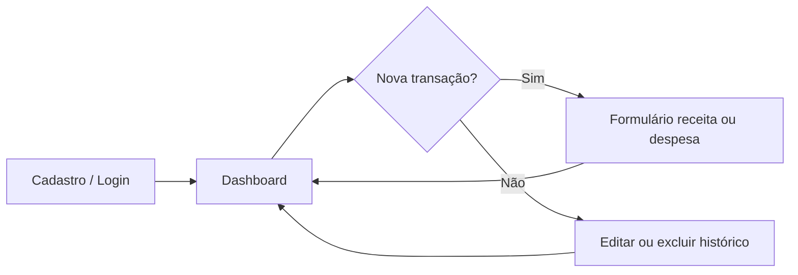
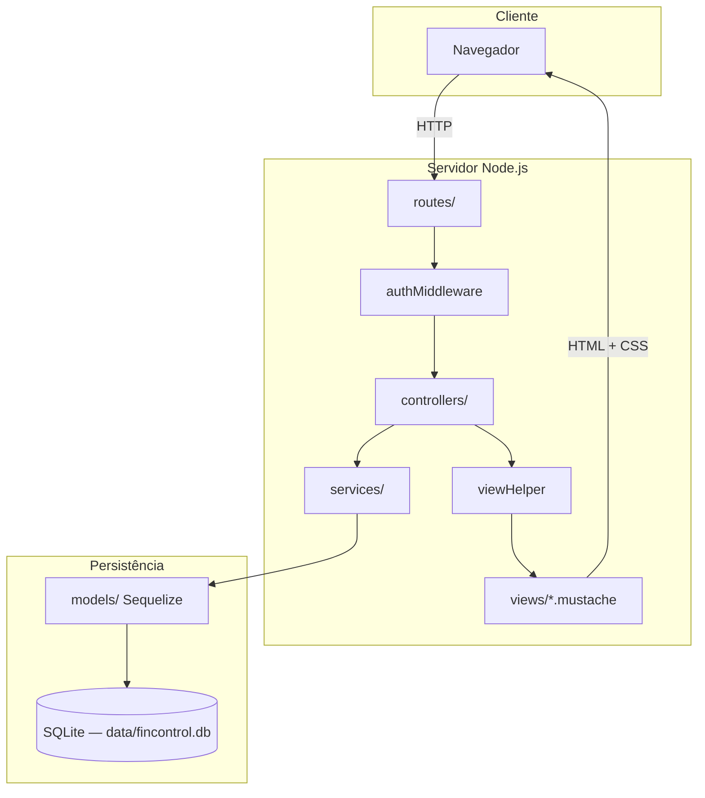
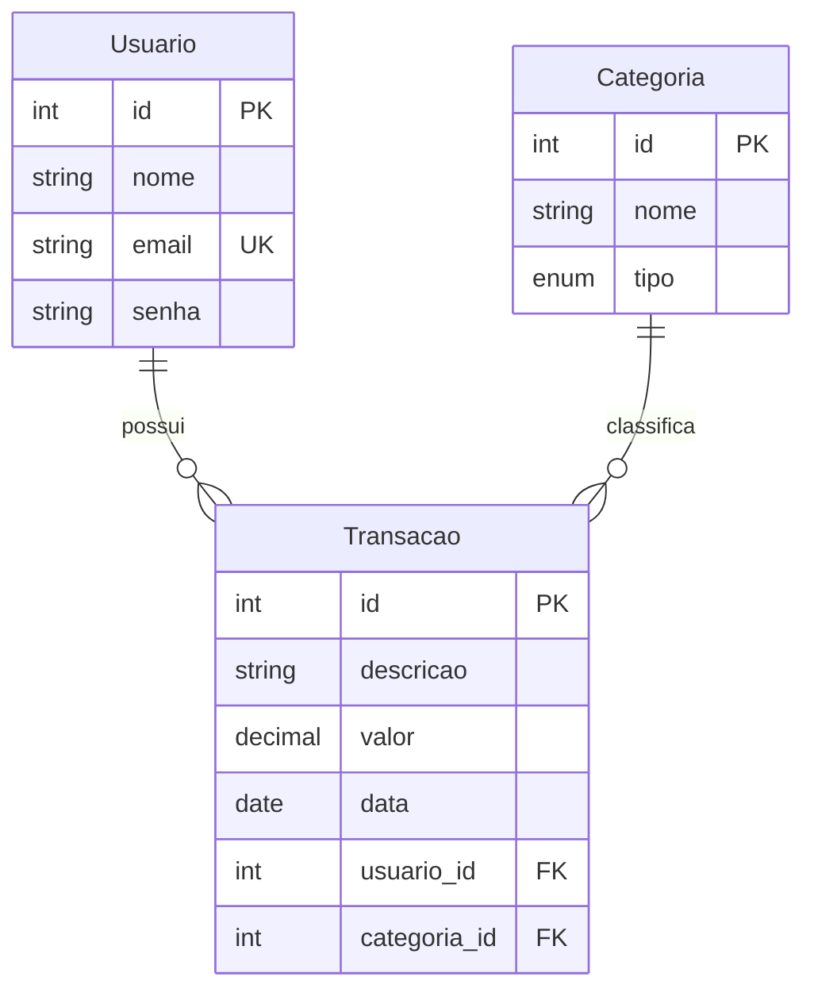

# FinControl

**Controle financeiro pessoal** em aplicação web full stack — projeto acadêmico **UCB, Grupo 3 (2026)**.

O FinControl permite que cada usuário registre receitas e despesas por categoria, acompanhe saldo, entradas e saídas em tempo real e consulte o histórico completo de transações em um painel único.

---

## Índice

- [Sobre o projeto](#sobre-o-projeto)
- [Problema e solução](#problema-e-solução)
- [Funcionalidades](#funcionalidades)
- [Demonstração rápida](#demonstração-rápida)
- [Arquitetura](#arquitetura)
- [Stack tecnológica](#stack-tecnológica)
- [Modelo de dados](#modelo-de-dados)
- [Como executar](#como-executar)
- [Estrutura do projeto](#estrutura-do-projeto)
- [Rotas da aplicação](#rotas-da-aplicação)
- [Documentação complementar](#documentação-complementar)
- [Licença e autoria](#licença-e-autoria)

---

## Sobre o projeto

O FinControl nasce da necessidade de organizar finanças pessoais de forma simples, sem planilhas ou aplicativos complexos. A aplicação oferece cadastro individual, autenticação segura e um fluxo direto: **login → dashboard → registrar transação → acompanhar saldo**.

| Aspecto | Detalhe |
| -------- | ------- |
| **Tipo** | Aplicação web monolítica (SSR) |
| **Público** | Usuário final — controle financeiro individual |
| **Instituição** | UCB — Grupo 3 |
| **Ano** | 2026 |
| **Licença** | [MIT](LICENSE) |

---

## Problema e solução

**Problema:** muitas pessoas não têm visibilidade clara de quanto entra, quanto sai e qual é o saldo disponível ao longo do mês.

**Solução:** o FinControl centraliza receitas e despesas em categorias pré-definidas, calcula totais automaticamente e exibe tudo em um dashboard responsivo, acessível pelo navegador.



---

## Funcionalidades

### Para o usuário

- **Conta pessoal** — cadastro com e-mail e senha; cada usuário vê apenas suas transações.
- **Dashboard** — saldo total, total de entradas, total de saídas e tabela com histórico ordenado por data.
- **Transações** — criar, editar e excluir receitas e despesas com descrição, valor, data e categoria.
- **Categorias** — 15 categorias padrão (5 receitas e 10 despesas), carregadas automaticamente na primeira execução.
- **Interface responsiva** — layout adaptado para desktop e mobile com Bootstrap 5.

### Aspectos técnicos

- Senhas armazenadas com hash **bcrypt** (nunca em texto puro).
- Sessão por usuário via **express-session**; rotas sensíveis protegidas por middleware.
- Separação em camadas: **Routes → Controllers → Services → Models**.
- Templates **Mustache** logic-less; formatação de moeda e datas no servidor (`viewHelper`).
- Banco **SQLite** local, sem dependência de servidor externo — ideal para desenvolvimento e demonstração.
- Script de **seed** com usuário demo e transações de exemplo para apresentações.

---

## Demonstração rápida

Ideal para apresentação em sala ou banca:

1. **Subir a aplicação**
   ```bash
   npm install
   npm run dev
   ```
2. **Popular dados de exemplo** (em outro terminal)
   ```bash
   npm run seed:demo
   ```
3. **Acessar** [http://localhost:8080](http://localhost:8080)
4. **Entrar com o usuário demo**

   | Campo | Valor |
   | ----- | ----- |
   | E-mail | `demo@fincontrol.com` |
   | Senha | `password` |

5. **Mostrar no dashboard** — saldo, cards de entrada/saída e histórico com categorias variadas (salário, moradia, lazer, investimentos etc.).
6. **Criar uma transação** — `/transacoes/nova`, escolher categoria de receita ou despesa e ver o painel atualizar.
7. **Editar ou excluir** — ações na tabela do dashboard.

Para limpar apenas as transações do seed (mantendo o usuário demo):

```bash
node scripts/seed-demo.js --force
```

---

## Arquitetura

A aplicação segue o padrão em camadas, com responsabilidades bem definidas:



| Camada | Responsabilidade |
| ------ | ---------------- |
| **Routes** | Mapeia URLs para controllers; aplica middleware de autenticação |
| **Controllers** | Orquestra request/response, sessão e renderização |
| **Services** | Regras de negócio, validações e acesso aos models |
| **Models** | Entidades, associações e persistência via Sequelize |
| **viewHelper + views** | Prepara view models (moeda, datas, listas) para templates Mustache |
| **public/** | CSS global e por tela (`auth`, `dashboard`, `transacoes`) |

Fluxo típico de uma requisição autenticada:

1. O usuário acessa `/dashboard`.
2. `authMiddleware` verifica `req.session.usuarioId`.
3. `DashboardController` chama `DashboardService`.
4. O service consulta transações e categorias no SQLite e calcula saldo.
5. O controller passa os dados pelo `viewHelper` e renderiza `dashboard/index.mustache`.

---

## Stack tecnológica

| Camada | Tecnologia | Versão |
| ------ | ---------- | ------ |
| Runtime | Node.js | 18+ recomendado |
| HTTP | Express | 4.x |
| Views | Mustache + mustache-express | 1.3.x |
| ORM | Sequelize | 6.37.x |
| Banco | SQLite (driver `sqlite3`) | 6.x |
| Sessão | express-session | 1.x |
| Segurança | bcryptjs | 2.4.x |
| UI | Bootstrap | 5.3.x |
| Ícones | Boxicons | 2.1.x |

---

## Modelo de dados



| Entidade | Campos principais | Observação |
| -------- | ----------------- | ---------- |
| **Usuario** | `nome`, `email`, `senha` | Senha persistida como hash bcrypt |
| **Categoria** | `nome`, `tipo` | `tipo`: `receita` ou `despesa` |
| **Transacao** | `descricao`, `valor`, `data`, `usuario_id`, `categoria_id` | Vinculada a um usuário e uma categoria |

**Categorias padrão (seed):** Salário, Transferências, Investimentos, Vendas, Outros (receita), Alimentação, Transporte, Moradia, Saúde, Educação, Lazer, Compras, Contas e utilidades, Assinaturas, Outros (despesa).

---

## Como executar

### Pré-requisitos

- [Node.js](https://nodejs.org/) 18 ou superior
- npm (incluso com o Node)

### Instalação

```bash
# Clonar o repositório e entrar na pasta
git clone <url-do-repositorio>
cd FinControl

# Instalar dependências
npm install

# Modo desenvolvimento (reload automático com --watch)
npm run dev

# Ou modo produção
npm start
```

Acesse: **[http://localhost:8080](http://localhost:8080)**

Na primeira execução, o Sequelize cria o banco em `data/fincontrol.db` e insere as categorias padrão se a tabela estiver vazia.

### Variáveis de ambiente (opcional)

| Variável | Padrão | Descrição |
| -------- | ------ | --------- |
| `PORT` | `8080` | Porta do servidor HTTP |
| `SESSION_SECRET` | valor interno | Segredo da sessão express-session |

---

## Estrutura do projeto

```text
FinControl/
├── app.js                 # Entrada: Express, sessão, sync do banco
├── config/
│   └── database.js        # Conexão SQLite (Sequelize)
├── constants/
│   └── categorias.js      # Lista de categorias do seed
├── controllers/           # Camada HTTP (render e redirect)
├── data/                  # Banco SQLite (gerado em runtime)
├── docs/
│   └── architecture.md    # Documentação de arquitetura
├── middlewares/
│   └── authMiddleware.js  # Proteção de rotas autenticadas
├── models/                # Entidades e associações Sequelize
├── public/                # CSS global e por página
├── routes/
│   └── index.js           # Mapa de rotas Express
├── scripts/
│   └── seed-demo.js       # Usuário e transações de demonstração
├── services/              # Regras de negócio
├── utils/
│   └── viewHelper.js      # View models para Mustache
└── views/                 # Templates .mustache
    ├── auth/              # Login e cadastro
    ├── dashboard/       # Painel principal
    └── transacoes/        # Formulário de transação
```

---

## Rotas da aplicação

| Método | Rota | Autenticação | Descrição |
| ------ | ---- | ------------ | --------- |
| GET | `/` | — | Redireciona para `/dashboard` |
| GET | `/login` | — | Tela de login |
| POST | `/login` | — | Autentica usuário e cria sessão |
| GET | `/cadastro` | — | Tela de cadastro |
| POST | `/cadastro` | — | Cria novo usuário |
| GET | `/logout` | sim | Encerra sessão |
| GET | `/dashboard` | sim | Painel com resumo e histórico |
| GET | `/transacoes/nova` | sim | Formulário de nova transação |
| POST | `/transacoes` | sim | Salva nova transação |
| GET | `/transacoes/:id/editar` | sim | Formulário de edição |
| POST | `/transacoes/:id` | sim | Atualiza transação |
| POST | `/transacoes/:id/deletar` | sim | Remove transação |

Rotas marcadas com **sim** exigem sessão ativa (`authMiddleware`).

---

## Documentação complementar

- **[docs/architecture.md](docs/architecture.md)** — camadas, fluxo de requisição, view engine e assets estáticos.

---

## Licença e autoria

Projeto acadêmico desenvolvido pelo **UCB — Grupo 3**, 2026.

Distribuído sob licença [MIT](LICENSE).
