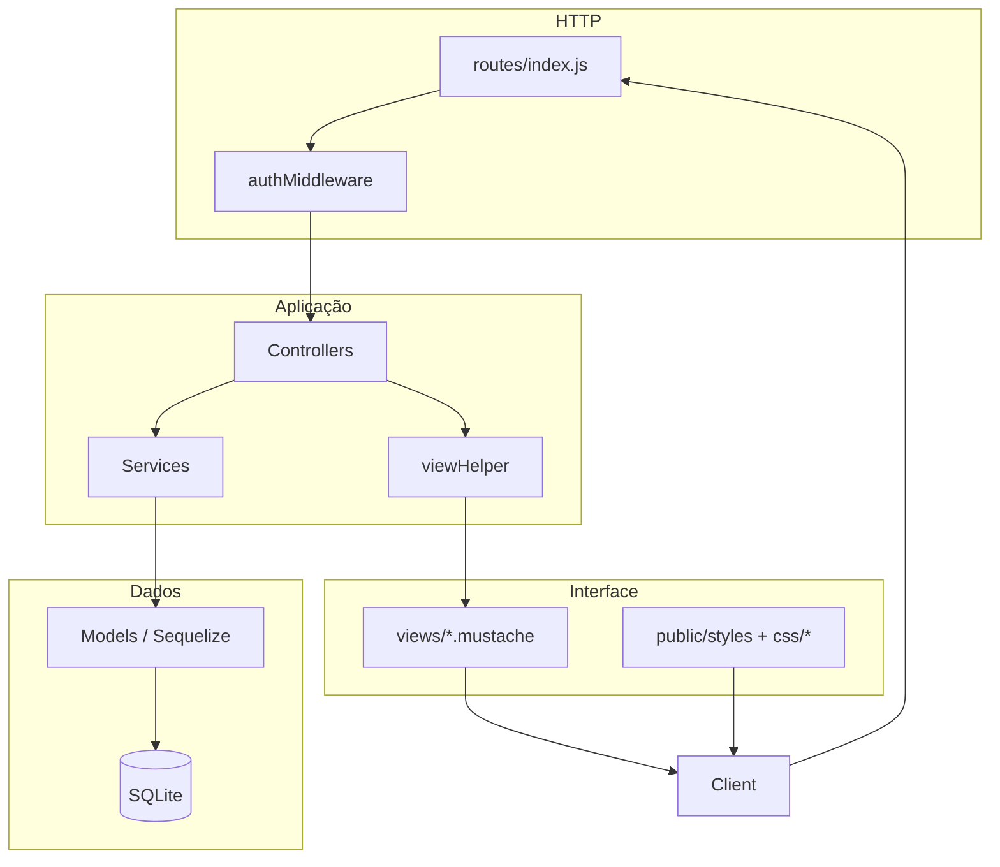

# Arquitetura e Estrutura do Projeto — FinControl

Este documento descreve a estrutura de diretórios e o fluxo arquitetural da aplicação **FinControl**, baseada em Node.js, Express, Sequelize (SQLite), Mustache e Bootstrap.

## Stack

| Camada | Tecnologia |
|--------|------------|
| Runtime | Node.js |
| HTTP | Express 4 |
| Views | Mustache (`mustache-express`) |
| ORM | Sequelize 6 |
| Banco | SQLite (`data/fincontrol.db`) |
| Sessão | `express-session` |
| Senha | `bcryptjs` |
| UI | Bootstrap 5 (CDN) + CSS próprio |

## Estrutura de pastas

```text
fincontrol/
├── config/
│   └── database.js              # Conexão SQLite via Sequelize
├── controllers/
│   ├── authController.js        # Login, cadastro e logout
│   ├── DashboardController.js   # Painel principal
│   └── TransacaoController.js   # CRUD de transações
├── data/                        # Criada em runtime; armazena fincontrol.db
│   └── fincontrol.db
├── docs/
│   └── architecture.md          # Este documento
├── middlewares/
│   └── authMiddleware.js        # Proteção de rotas autenticadas
├── models/
│   ├── index.js                 # Sequelize, associações e export dos modelos
│   ├── Categoria.js
│   ├── Transacao.js
│   └── Usuario.js
├── public/
│   ├── styles.css               # Estilos globais (Bootstrap + tema base)
│   └── css/
│       ├── auth.css             # Login e cadastro (layout split-screen)
│       ├── dashboard.css        # Painel, cards de resumo e tabela
│       └── transacoes.css       # Formulário de nova/edição de transação
├── routes/
│   └── index.js                 # Definição de todas as rotas HTTP
├── services/
│   ├── authService.js           # Cadastro, hash de senha e autenticação
│   ├── DashboardService.js      # Saldo, totais e histórico
│   └── TransacaoService.js      # Regras de negócio do CRUD de transações
├── utils/
│   └── viewHelper.js            # Formatação e view models para templates Mustache
├── views/
│   ├── auth/
│   │   ├── login.mustache
│   │   └── cadastro.mustache
│   ├── dashboard/
│   │   └── index.mustache
│   └── transacoes/
│       └── form.mustache
├── app.js                       # Bootstrap do Express, sessão e sync do banco
├── package.json
└── README.md
```

## Camadas e responsabilidades



- **Routes:** mapeiam URLs para métodos dos controllers; rotas protegidas passam por `authMiddleware`.
- **Controllers:** leem `req`/`res` e `req.session`, chamam services e renderizam views ou redirecionam.
- **Services:** concentram regras de negócio e acesso aos models (sem conhecer HTTP).
- **Models:** definem tabelas e relacionamentos (`Usuario` 1:N `Transacao`, `Categoria` 1:N `Transacao`).
- **viewHelper:** prepara dados para o Mustache (moeda, datas, listas, formulário de transação), pois os templates são logic-less.
- **Views:** HTML com Mustache; cada página inclui `styles.css` e o CSS específico em `public/css/`.

## View engine

Em `app.js`:

```js
app.engine('mustache', mustacheExpress());
app.set('view engine', 'mustache');
app.set('views', path.join(__dirname, 'views'));
```

Chamadas como `res.render('dashboard/index', dados)` resolvem para `views/dashboard/index.mustache`.

## Rotas principais

| Método | Rota | Autenticação | Controller |
|--------|------|--------------|------------|
| GET | `/` | — | redirect → `/dashboard` |
| GET/POST | `/login` | — | `authController` |
| GET/POST | `/cadastro` | — | `authController` |
| GET | `/logout` | sim | `authController` |
| GET | `/dashboard` | sim | `DashboardController` |
| GET | `/transacoes/nova` | sim | `TransacaoController` |
| POST | `/transacoes` | sim | `TransacaoController` |
| GET | `/transacoes/:id/editar` | sim | `TransacaoController` |
| POST | `/transacoes/:id` | sim | `TransacaoController` |
| POST | `/transacoes/:id/deletar` | sim | `TransacaoController` |

## Modelo de dados (resumo)

- **Usuario:** `nome`, `email`, `senha` (hash bcrypt).
- **Categoria:** `nome`, `tipo` (`receita` | `despesa`); seed automático na primeira execução.
- **Transacao:** `descricao`, `valor`, `data`, `usuario_id`, `categoria_id`.

## Assets estáticos

`app.js` expõe `public/` em `/`. Cada view referencia:

- `/styles.css` — variáveis de tema, navbar, botões e formulários globais.
- `/css/auth.css`, `/css/dashboard.css` ou `/css/transacoes.css` — conforme a tela.
